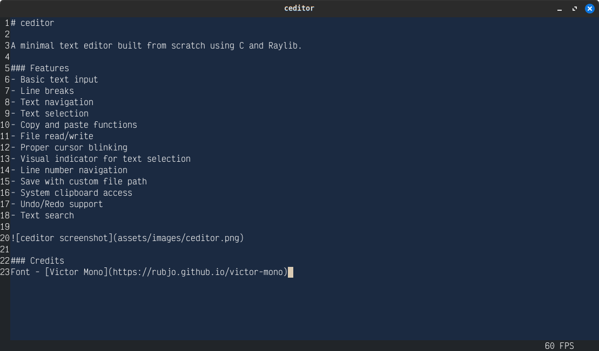

# ceditor

A minimal text editor built from scratch using C and Raylib.

### Features
- Basic text input
- Line breaks
- Text navigation
- Text selection
- Copy and paste functions
- File read/write
- Proper cursor blinking
- Visual indicator for text selection
- Line number navigation
- Save with custom file path
- System clipboard access
- Undo/Redo support
- Text search

### Credits
Font - [Victor Mono](https://rubjo.github.io/victor-mono)